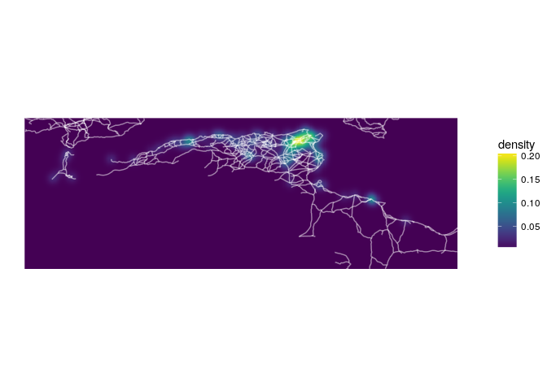
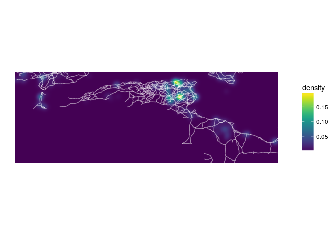
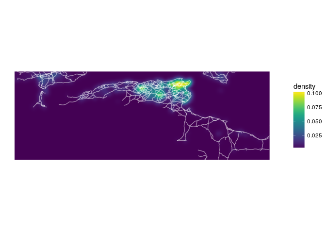
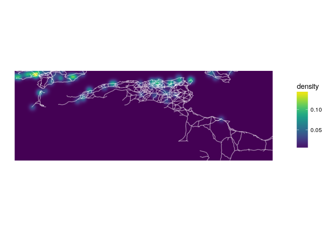
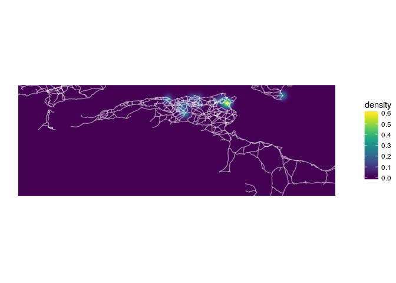
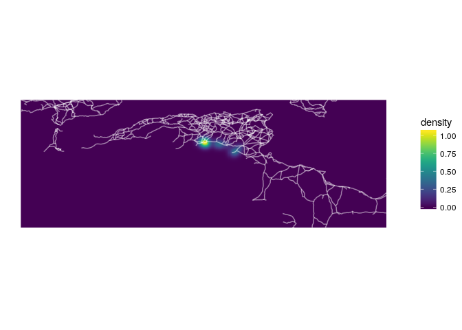
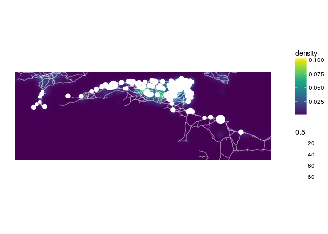

# Mapping Roman North Africa
Nick  
6/8/2017  


```r
library(raster)
```

```
## Loading required package: sp
```

```r
library(rgdal)
```

```
## rgdal: version: 1.2-7, (SVN revision 660)
##  Geospatial Data Abstraction Library extensions to R successfully loaded
##  Loaded GDAL runtime: GDAL 2.1.2, released 2016/10/24
##  Path to GDAL shared files: /usr/share/gdal/2.1
##  Loaded PROJ.4 runtime: Rel. 4.9.3, 15 August 2016, [PJ_VERSION: 493]
##  Path to PROJ.4 shared files: (autodetected)
##  Linking to sp version: 1.2-4
```

```r
library(rasterVis)
```

```
## Loading required package: lattice
```

```
## Loading required package: latticeExtra
```

```
## Loading required package: RColorBrewer
```

```r
library(viridis)
```

```
## Loading required package: viridisLite
```

```r
library(tidyverse)
```

```
## Loading tidyverse: ggplot2
## Loading tidyverse: tibble
## Loading tidyverse: tidyr
## Loading tidyverse: readr
## Loading tidyverse: purrr
## Loading tidyverse: dplyr
```

```
## Conflicts with tidy packages ----------------------------------------------
```

```
## extract(): tidyr, raster
## filter():  dplyr, stats
## lag():     dplyr, stats
## layer():   ggplot2, latticeExtra
## select():  dplyr, raster
```

```r
library(stringr)
library(pleiades)
```

Import SRTM basemap

```r
bbox <- extent(-10, 20, 28, 38)
```


```r
cities <- read.csv('NA_cities.csv') %>%
  group_by(BA_rank) %>% 
  mutate(size_est = ifelse(is.na(Size), mean(Size, na.rm=TRUE), Size)) %>%
  mutate(population = 1.7 * Size^.635, pop_est = 1.7 * size_est^.635)

roads <- readOGR('Data/Shapefiles/ba_roads.shp') %>%
  spTransform(CRS('+proj=longlat')) %>%
  crop(bbox) %>%
  fortify
```

```
## OGR data source with driver: ESRI Shapefile 
## Source: "Data/Shapefiles/ba_roads.shp", layer: "ba_roads"
## with 3166 features
## It has 25 fields
```

```
## Warning in readOGR("Data/Shapefiles/ba_roads.shp"): Dropping null
## geometries: 2221
```

```
## Loading required namespace: rgeos
```

```r
aqueducts <- readOGR('Data/Shapefiles/aqueducts.shp') %>%
  spTransform(CRS('+proj=longlat')) %>%
  crop(bbox)
```

```
## OGR data source with driver: ESRI Shapefile 
## Source: "Data/Shapefiles/aqueducts.shp", layer: "aqueducts"
## with 323 features
## It has 21 fields
```


```r
ggplot(cities, aes(lon, lat)) +
  geom_path(data = roads, aes(long, lat, group = group), alpha = .5) +
  geom_point(aes(color = pop_est, size = pop_est), alpha = .8) +
  scale_size_area() +
  scale_color_viridis() +
  theme_void() +
  coord_fixed()
```

<!-- -->


```r
with(cities, cities[rep(1:nrow(cities), pop_est),]) %>%
ggplot(aes(lon, lat)) +
  stat_density_2d(aes(fill = ..density..), geom = "raster", contour = F, n = 500, h = 1) +
  geom_path(data = roads, aes(long, lat, group = group), alpha = .5, color = 'white') +
  scale_fill_viridis() +
  coord_fixed() +
  theme_void()
```

<!-- -->


  

```r
places <- pl_search_places() %>%
  filter(locationPrecision == 'precise') %>%
  select(title, type = featureTypes, description, 
         lon = reprLong, lat = reprLat, 
         periods = timePeriods, minDate, maxDate, id, tags) %>%
  filter(between(lat, 28, 38) & between(lon, -10, 20)) %>%
  collect  %>%
  filter(str_detect(periods, 'R')) %>%
  print
```

```
## # A tibble: 3,068 x 10
##                              title       type
##                              <chr>      <chr>
##  1              Cueva de la Paloma       mine
##  2                           Ebura settlement
##  3                      Eliocroca? settlement
##  4 Roman Villa at El Faro (Torrox)      villa
##  5              Ficariensis Locus? settlement
##  6                       Fraxinum? settlement
##  7           Fuente de las Piedras      villa
##  8              Hoyo de la Campana       mine
##  9                 Igabrum/Egabrum settlement
## 10                        Iliberri settlement
## # ... with 3,058 more rows, and 8 more variables: description <chr>,
## #   lon <dbl>, lat <dbl>, periods <chr>, minDate <int>, maxDate <int>,
## #   id <dbl>, tags <chr>
```

```r
places %>% filter(str_detect(type, 'villa')) %>%
ggplot(aes(lon, lat)) +
  stat_density_2d(aes(fill = ..density..), geom = "raster", contour = F, n = 500, h = 1) +
  geom_path(data = roads, aes(long, lat, group = group), alpha = .5, color = 'white') +
  scale_fill_viridis() +
  coord_fixed() +
  theme_void()
```

```
## Warning: call dbDisconnect() when finished working with a connection
```

<!-- -->

```r
places %>% filter(str_detect(type, 'settlement')) %>%
ggplot(aes(lon, lat)) +
  stat_density_2d(aes(fill = ..density..), geom = "raster", contour = F, n = 500, h = 1) +
  geom_path(data = roads, aes(long, lat, group = group), alpha = .5, color = 'white') +
  scale_fill_viridis() +
  coord_fixed() +
  theme_void()
```

<!-- -->

```r
places %>% filter(str_detect(type, 'mine')) %>%
ggplot(aes(lon, lat)) +
  stat_density_2d(aes(fill = ..density..), geom = "raster", contour = F, n = 500, h = 1) +
  geom_path(data = roads, aes(long, lat, group = group), alpha = .5, color = 'white') +
  scale_fill_viridis() +
  coord_fixed() +
  theme_void()
```

<!-- -->

```r
places %>% filter(str_detect(type, 'spring')) %>%
ggplot(aes(lon, lat)) +
  stat_density_2d(aes(fill = ..density..), geom = "raster", contour = F, n = 500, h = 1) +
  geom_path(data = roads, aes(long, lat, group = group), alpha = .5, color = 'white') +
  scale_fill_viridis() +
  coord_fixed() +
  theme_void()
```

<!-- -->

```r
places %>% filter(str_detect(type, 'oasis')) %>%
ggplot(aes(lon, lat)) +
  stat_density_2d(aes(fill = ..density..), geom = "raster", contour = F, n = 500, h = 1) +
  geom_path(data = roads, aes(long, lat, group = group), alpha = .5, color = 'white') +
  scale_fill_viridis() +
  coord_fixed() +
  theme_void()
```

<!-- -->

```r
places %>% filter(str_detect(type, 'settlement')) %>%
ggplot(aes(lon, lat)) +
  stat_density_2d(aes(fill = ..density..), geom = "raster", contour = F, n = 500, h = 1) +
  geom_path(data = roads, aes(long, lat, group = group), alpha = .5, color = 'white') +
  scale_fill_viridis() +
  coord_fixed() +
  theme_void() +
  geom_point(data = cities, aes(lon, lat, size = pop_est), color = 'white') +
  scale_size_area()
```

<!-- -->
Compare to environmental covariates


Create conductance matrix with geocorrection for lcps


Create conductance matrix with geocorrection for random walks


