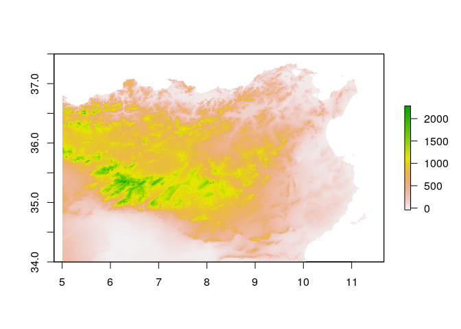

## Import and setup
Load required packages

```r
library(raster)
```

```
## Loading required package: sp
```

```r
library(rgdal)
```

```
## rgdal: version: 1.2-16, (SVN revision 701)
##  Geospatial Data Abstraction Library extensions to R successfully loaded
##  Loaded GDAL runtime: GDAL 2.2.1, released 2017/06/23
##  Path to GDAL shared files: /usr/share/gdal/2.2
##  GDAL binary built with GEOS: TRUE 
##  Loaded PROJ.4 runtime: Rel. 4.9.3, 15 August 2016, [PJ_VERSION: 493]
##  Path to PROJ.4 shared files: (autodetected)
##  Linking to sp version: 1.2-6
```

```r
library(rasterVis)
```

```
## Loading required package: lattice
```

```
## Loading required package: latticeExtra
```

```
## Loading required package: RColorBrewer
```

```r
library(viridis)
```

```
## Loading required package: viridisLite
```

```r
library(tidyverse)
```

```
## ── Attaching packages ─────────────────────────────────────── tidyverse 1.2.1 ──
```

```
## ✔ ggplot2 2.2.1     ✔ purrr   0.2.4
## ✔ tibble  1.4.2     ✔ dplyr   0.7.4
## ✔ tidyr   0.8.0     ✔ stringr 1.2.0
## ✔ readr   1.1.1     ✔ forcats 0.2.0
```

```
## ── Conflicts ────────────────────────────────────────── tidyverse_conflicts() ──
## ✖ tidyr::extract() masks raster::extract()
## ✖ dplyr::filter()  masks stats::filter()
## ✖ dplyr::lag()     masks stats::lag()
## ✖ ggplot2::layer() masks latticeExtra::layer()
## ✖ dplyr::select()  masks raster::select()
```

```r
library(stringr)
library(pleiades)
```
Define map extent.

```r
bbox <- extent(5, 11.5, 34, 37.5)
```
## Elevation Data
Get country boundaries for spain, portugal, and italy to mask out from elevation

```r
euro.mask <- rbind(getData('GADM', country = 'PRT', level = 0),
                   getData('GADM', country = 'ESP', level = 0),
                   getData('GADM', country = 'ITA', level = 0))
```

First download and mosaic 90m srtm tiles over the study area.

```r
#getData('SRTM', lon = -8, lat = 35)
#getData('SRTM', lon = -3, lat = 35)
#getData('SRTM', lon = 2, lat = 35)
getData('SRTM', lon = 7, lat = 35)
getData('SRTM', lon = 12, lat = 35, path = 'data/')
#getData('SRTM', lon = -8, lat = 40)
#getData('SRTM', lon = -3, lat = 40)
#getData('SRTM', lon = 2, lat = 40)
getData('SRTM', lon = 7, lat = 40, path = 'data')
getData('SRTM', lon = 12, lat = 40, path = 'data')


srtm <- list.files(pattern = '*.tif', recursive = T) %>% 
  lapply(raster) %>% 
  do.call(merge, .) #%>%
  mask(euro.mask, inverse = T)

writeRaster(srtm, 'srtm_na.tif')
srtm <- raster('data/srtm_na.tif')
```


```r
srtm <- raster('~/gdrive/Data/SRTM_1km.tif') %>% crop(bbox)
plot(srtm)
```

<!-- -->


```r
plot(srtm)
```

<!-- -->


```r
slope <- terrain(srtm, opt = 'slope', filename = 'slope.tif', overwrite = T)
aspect <- terrain(srtm, opt = 'aspect', filename = 'aspect.tif', overwrite = T)
TPI <- terrain(srtm, opt = 'TPI', filename = 'TPI.tif', overwrite = T)
TRI <- terrain(srtm, opt = 'TRI', filename  = 'TRI.tif', overwrite = T)
roughness <- terrain(srtm, opt = 'roughness', filename = 'roughness.tif', overwrite = T)
flowdir <- terrain(srtm, opt = 'flowdir', filename = 'flowdir.tif', overwrite = T)
```


```r
plot(slope)
plot(aspect)
plot(TPI)
plot(TRI)
plot(roughness)
plot(flowdir)
```


```r
dist_coast <- srtm %>%
  reclassify(c(-Inf, Inf, NA, NA, NA, 1)) %>% # reverse NA and non-NA cells
  distance(doEdge = T) %>% # calculate the distances
  mask(srtm) %>% # mask out ocean cells  
  `/`(1000) # convert to km
writeRaster(dist_coast, 'data/topography/coast.tif')
```


```r
dist_coast <- raster('data/topography/coast.tif')
plot(dist_coast < 2)
```

<!-- -->


```r
cities <- read.csv('data/NA_cities.csv') %>%
  group_by(BA_rank) %>% 
  mutate(size_est = ifelse(is.na(Size), mean(Size, na.rm=TRUE), Size)) %>%
  ungroup %>%
  mutate(population = 41.834 * Size^1.3361, pop_est = 41.834 * size_est^1.3361) %>%
  filter(between(lat, ymin(srtm), ymax(srtm)) & between(lon, xmin(srtm), xmax(srtm))) %>%
  mutate(coastal = (1 >= raster::extract(dist_coast, cbind(lon, lat))))

#coordinates(cities) <- ~lon + lat
#shapefile(cities, filename = 'NA_cities')
```


```r
roads <- readOGR('data/Shapefiles/ba_roads.shp') %>%
  spTransform(CRS('+proj=longlat')) %>%
  crop(bbox) %>%
  fortify
```

```
## OGR data source with driver: ESRI Shapefile 
## Source: "data/Shapefiles/ba_roads.shp", layer: "ba_roads"
## with 3166 features
## It has 25 fields
```

```
## Warning in readOGR("data/Shapefiles/ba_roads.shp"): Dropping null
## geometries: 2221
```

```
## Loading required namespace: rgeos
```

```r
aqueducts <- readOGR('data/Shapefiles/aqueducts.shp') %>%
  spTransform(CRS('+proj=longlat')) %>%
  crop(bbox)
```

```
## OGR data source with driver: ESRI Shapefile 
## Source: "data/Shapefiles/aqueducts.shp", layer: "aqueducts"
## with 323 features
## It has 21 fields
```

```r
centuriation <- readOGR('data/Shapefiles/centuriation_polygons.shp') %>%
  spTransform(CRS('+proj=longlat')) %>%
  crop(bbox) %>%
  fortify
```

```
## OGR data source with driver: ESRI Shapefile 
## Source: "data/Shapefiles/centuriation_polygons.shp", layer: "centuriation_polygons"
## with 221 features
## It has 4 fields
```

```
## Regions defined for each Polygons
```


```r
ggplot(cities, aes(lon, lat)) +
  geom_path(data = roads, aes(long, lat, group = group), color = 'lightgrey') +
  geom_point(aes(size = pop_est * 10)) +
  scale_size_area() +
  theme_void() +
  coord_fixed() + theme(legend.position="none")
```

<!-- -->

```r
ggsave('roman_network.png')
```

```
## Saving 7 x 5 in image
```

```r
gplot(roughness) +
  geom_tile(aes(fill = value)) +
    geom_path(data = roads, aes(long, lat, group = group), alpha = .5, color = 'lightgrey') +
  scale_fill_viridis() +
  coord_equal()
```


```r
places <- pl_search_places() %>%
  filter(locationPrecision == 'precise') %>%
  select(title, type = featureTypes, description, 
         lon = reprLong, lat = reprLat, 
         periods = timePeriods, minDate, maxDate, id, tags) %>%
  collect  %>%
  filter(between(lat, ymin(srtm), ymax(srtm)) & between(lon, xmin(srtm), xmax(srtm))) %>%
  filter(str_detect(periods, 'R')) %>%
  print
```

```
## # A tibble: 1,817 x 10
##    title   type   description     lon   lat periods minDate maxDate     id
##    <chr>   <chr>  <chr>         <dbl> <dbl> <chr>     <int>   <int>  <dbl>
##  1 Ad Rub… stati… An ancient p…  7.16  36.1 RL         - 30     640 305023
##  2 Ad Sav… settl… An ancient p…  5.07  36.3 RL         - 30     640 305024
##  3 Ain Sm… mine   An ancient p…  6.50  36.3 RL         - 30     640 305027
##  4 Aquae … settl… An ancient p…  7.27  36.5 RL         - 30     640 305030
##  5 *Astor… settl… An ancient p…  6.88  36.9 HRL        -330     640 305032
##  6 Asuccu… settl… An ancient p…  7.52  36.6 RL         - 30     640 305033
##  7 Calama  settl… An ancient p…  7.43  36.5 HRL        -330     640 305039
##  8 Caput … spring An ancient p…  6.02  36.2 R          - 30     300 305040
##  9 Castel… settl… An ancient p…  6.46  36.3 RL         - 30     640 305043
## 10 Castel… settl… An ancient p…  5.20  36.2 RL         - 30     640 305044
## # ... with 1,807 more rows, and 1 more variable: tags <chr>
```
Plot everything

```r
places %>% filter(str_detect(type, 'settlement|villa')) %>%
ggplot(aes(lon, lat)) +
  stat_density_2d(aes(fill = ..density..), geom = "raster", contour = F, n = 500, alpha = .8) +
  geom_path(data = roads, aes(long, lat, group = group), color = 'lightgrey') +
  scale_fill_viridis() +
  coord_fixed() +
  theme_void() +
  geom_point(data = cities, aes(lon, lat, size = pop_est)) +
  scale_size_area()
```

<!-- -->

Settlements

```r
places %>% filter(str_detect(type, 'settlement')) %>%
ggplot(aes(lon, lat)) +
  stat_density_2d(aes(fill = ..density..), geom = "raster", contour = F, n = 500, h = 1, alpha = .8) +
  geom_path(data = roads, aes(long, lat, group = group), color = 'lightgrey') +
  scale_fill_viridis() +
  coord_fixed() +
  theme_void() +
  geom_point(data = cities, aes(lon, lat, size = pop_est)) +
  scale_size_area()
```

<!-- -->
Villas

```r
places %>% filter(str_detect(type, 'villa')) %>%
ggplot(aes(lon, lat)) +
  stat_density_2d(aes(fill = ..density..), geom = "raster", contour = F, n = 500, h = 1, alpha = .8) +
  geom_path(data = roads, aes(long, lat, group = group), color = 'lightgrey') +
  scale_fill_viridis() +
  coord_fixed() +
  theme_void() +
  geom_point(data = cities, aes(lon, lat, size = pop_est)) +
  scale_size_area()
```

<!-- -->

Mines

```r
places %>% filter(str_detect(type, 'mine')) %>%
ggplot(aes(lon, lat)) +
  stat_density_2d(aes(fill = ..density..), geom = "raster", contour = F, n = 500, h = 1) +
  geom_path(data = roads, aes(long, lat, group = group), alpha = .5, color = 'white') +
  scale_fill_viridis() +
  coord_fixed() +
  theme_void()
```

<!-- -->


Springs and oases

```r
places %>% filter(str_detect(type, 'spring')) %>%
ggplot(aes(lon, lat)) +
  stat_density_2d(aes(fill = ..density..), geom = "raster", contour = F, n = 500, h = 1) +
  geom_path(data = roads, aes(long, lat, group = group), alpha = .5, color = 'white') +
  scale_fill_viridis() +
  coord_fixed() +
  theme_void()
```

<!-- -->

```r
places %>% filter(str_detect(type, 'oasis')) %>%
ggplot(aes(lon, lat)) +
  stat_density_2d(aes(fill = ..density..), geom = "raster", contour = F, n = 500, h = 1) +
  geom_path(data = roads, aes(long, lat, group = group), alpha = .5, color = 'white') +
  scale_fill_viridis() +
  coord_fixed() +
  theme_void()
```

<!-- -->


Reproject and save out shapefile

```r
settlements <- places %>% filter(str_detect(type, 'settlement'))
coordinates(settlements) <- ~lon + lat
proj4string(settlements) <- '+proj=longlat'
settlements <- spTransform(settlements, CRS("+proj=lcc +lat_1=43 +lat_2=62 +lat_0=30 +lon_0=10 +x_0=0 +y_0=0 +ellps=intl +units=m +no_defs"))

shapefile(settlements, filename = 'data/netlogo/settlements')
```


Compare to environmental covariates


```r
library(gdistance)
```

```
## Loading required package: igraph
```

```
## 
## Attaching package: 'igraph'
```

```
## The following objects are masked from 'package:dplyr':
## 
##     as_data_frame, groups, union
```

```
## The following objects are masked from 'package:purrr':
## 
##     compose, simplify
```

```
## The following object is masked from 'package:tidyr':
## 
##     crossing
```

```
## The following object is masked from 'package:tibble':
## 
##     as_data_frame
```

```
## The following object is masked from 'package:raster':
## 
##     union
```

```
## The following objects are masked from 'package:stats':
## 
##     decompose, spectrum
```

```
## The following object is masked from 'package:base':
## 
##     union
```

```
## Loading required package: Matrix
```

```
## 
## Attaching package: 'Matrix'
```

```
## The following object is masked from 'package:tidyr':
## 
##     expand
```

```
## 
## Attaching package: 'gdistance'
```

```
## The following object is masked from 'package:igraph':
## 
##     normalize
```

```r
altDiff <- function(x){x[2] - x[1]}
hd <- transition(srtm, altDiff, 16, symm=FALSE)
```

```
## Warning in .TfromR(x, transitionFunction, directions, symm): transition
## function gives negative values
```

```r
cell.targets <- Which(!is.na(srtm), cells = T)
adj <- adjacent(srtm, cells=cell.targets, target = cell.targets, pairs=TRUE, directions=16)
```

Create conductance matrix with geocorrection for lcps

```r
slope.c <- geoCorrection(hd, type = 'c')
speed.c <- slope.c
speed.c[adj] <- 6 * exp(-3.5 * abs(slope.c[adj] + 0.05))
Conductance.c <- geoCorrection(speed.c, type = 'c')
rm(slope.c, speed.c)
```


```r
start_cities <- cities %>%
  select(lon, lat) %>%
  as.matrix

acc <- accCost(Conductance.c, start_cities) %>%
  mask(srtm)

acc %>%
  `/`(3600) %>%
  as.data.frame(xy = T, na.rm = T) %>%
ggplot(aes(x, y)) +
  geom_tile(aes(fill = layer)) +
  geom_polygon(data = centuriation, aes(long, lat, group = group), fill = 'lightgrey') +
  theme_void() +
  geom_point(data = places %>% filter(str_detect(type, 'settlement|villa')), aes(lon, lat), size = .5, alpha = .5) +
    geom_path(data = roads, aes(long, lat, group = group), alpha = .1) +
    geom_point(data = cities, aes(lon, lat, size = pop_est)) +
  scale_fill_viridis(direction = -1) +
  coord_quickmap() +
  theme(legend.position="none")
```

<!-- -->


```r
library(tidygraph)
```

```
## 
## Attaching package: 'tidygraph'
```

```
## The following object is masked from 'package:igraph':
## 
##     groups
```

```
## The following object is masked from 'package:raster':
## 
##     select
```

```
## The following object is masked from 'package:stats':
## 
##     filter
```

```r
library(ggraph)
```

```
## 
## Attaching package: 'ggraph'
```

```
## The following object is masked from 'package:sp':
## 
##     geometry
```

```r
dist.mat <- costDistance(Conductance.c, start_cities) %>%
  `/`(3600) %>%
  as_tbl_graph(diagonal = F) %>%
  mutate(name = cities$Name, population = 1, attractiveness = 1, x = cities$lon, y = cities$lat, pop = cities$population, pop_est = cities$pop_est, coastal = cities$coastal) %E>%
  group_by(from) %>%
  rename(distance = weight) %>%
  filter(row_number(distance) <= 10) %>%
  ungroup


interact <- function(net){
  net %E>%
    mutate(interaction_strength = .N()$attractiveness[to] ^ alpha * exp(-beta * distance))  %N>%
    mutate(outflow = population / centrality_degree(weights = interaction_strength, mode = 'out', loops = F)) %E>%
    mutate(flow = .N()$outflow[from] * interaction_strength) %N>%
    mutate(inflow = centrality_degree(weights = flow, mode = 'in', loops = F)) %>%
    mutate(attractiveness = attractiveness + .01 * (inflow * coast_effect * coastal + inflow  - attractiveness)) %>%
    mutate(population = 97 * attractiveness / sum(attractiveness))
}

alpha <- 1.05
beta <- .57
coast_effect <- .5

net <- dist.mat
for(i in 1:500){
  net <- interact(net)
}

net %E>%
 group_by(from) %>%
  filter(flow == max(flow), .N()$population[from] < .N()$population[to]) %N>%
  mutate(terminal = node_is_sink()) %>%
ggraph(layout = 'manual', node.positions = as_tibble(activate(dist.mat, nodes))) +
  geom_edge_link(alpha = .6) +
  geom_node_point(aes(size = population, color = terminal)) +
 # geom_node_label(aes(label = name)) +
  scale_size_area() +
  coord_quickmap() +
  theme_void()
```

```
## Ungrouping graph...
```

<!-- -->


```r
ggraph(net, layout = 'manual', node.positions = as_tibble(activate(dist.mat, nodes))) +
  geom_edge_link(alpha = .1) +
  geom_node_point(aes(size = pop_est / mean(pop_est))) +
  scale_size_area() +
  coord_quickmap() +
  theme_void()
```

<!-- -->


```r
costAll <- function(fromCoords, cost){
  
  aC <- srtm
  for(i in 1:dim(fromCoords)[1]) {aC <- stack(aC, accCost(cost, fromCoords[i,]))}
  aC <- dropLayer(aC,1)
  alC <- calc(aC, which.min)
  return(alC)
}

#https://stat.ethz.ch/pipermail/r-sig-geo/2011-July/012208.html
  
cum.cost <- net %E>%
 group_by(from) %>%
  filter(flow == max(flow), .N()$population[from] < .N()$population[to]) %N>%
  filter(node_is_sink()) %>%
  as_tibble %>%
  select(x, y) %>%
  as.matrix %>%
  costAll(Conductance.c) %>%
  mask(srtm) 
```

```
## Ungrouping graph...
```


```r
terminal <- net %E>%
 group_by(from) %>%
  filter(flow == max(flow), .N()$population[from] < .N()$population[to]) %>%
    ungroup %N>%
    mutate(terminal = group_components()) %>%
  as_tibble %>%
  select(terminal) %>%
    cbind(1:97, .)

test <- cities %>%
 select(lon, lat) %>%
  as.matrix %>%
  costAll(Conductance.c) %>%
  mask(srtm) %>%
  reclassify(terminal) %>%
  rasterToPolygons(dissolve = T) %>% 
  fortify
```

```
## Regions defined for each Polygons
```

```r
net %E>%
 group_by(from) %>%
  filter(flow == max(flow), .N()$population[from] < .N()$population[to]) %N>%
  mutate(terminal = node_is_sink()) %>%
ggraph(layout = 'manual', node.positions = as_tibble(activate(dist.mat, nodes))) +
  geom_path(data = test, aes(long, lat, group = group), alpha = .1) +
  geom_point(data = places %>% filter(str_detect(type, 'settlement|villa')), aes(lon, lat), size = .5, alpha = .2) +
  geom_edge_link(alpha = .6) +
  geom_node_point(aes(size = population, color = terminal)) +
 # geom_node_label(aes(label = name)) +
  scale_size_area() +
  coord_quickmap() +
  theme_void() +
  theme(legend.position="none")
```

```
## Ungrouping graph...
```

<!-- -->

